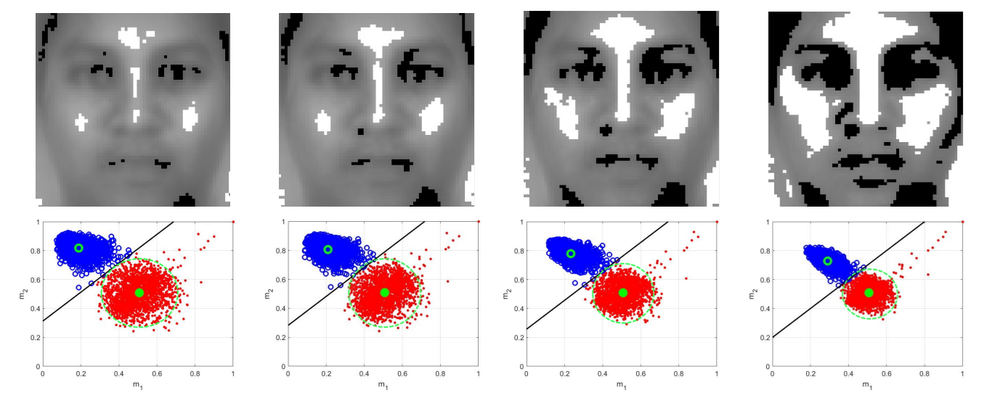
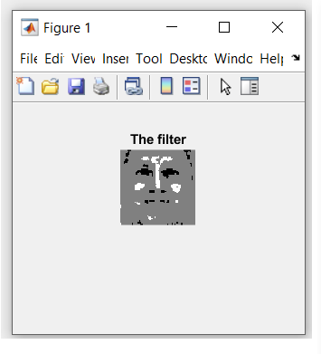
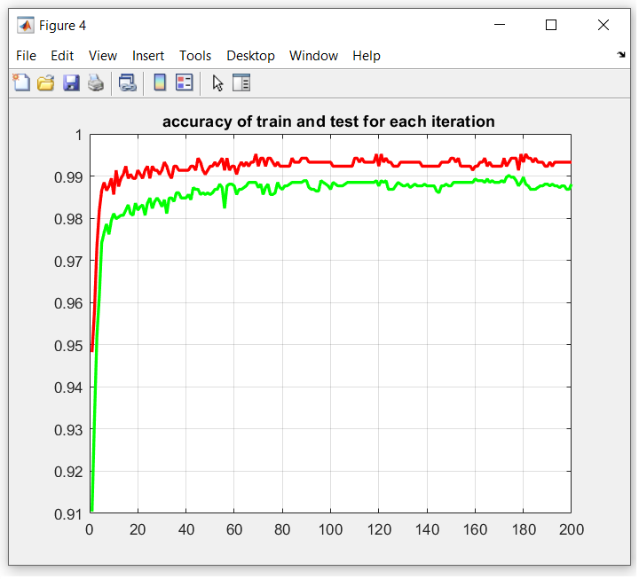
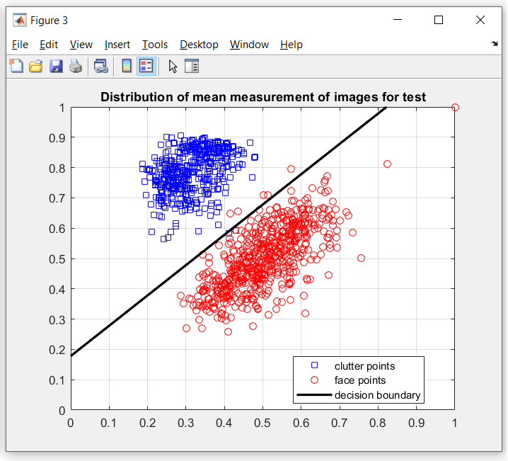
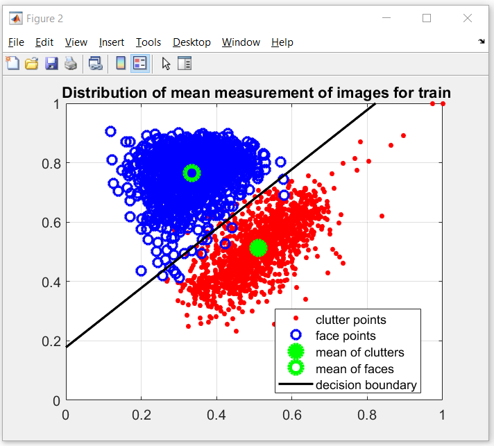

# Project Title: Enhanced Facial Feature Extraction and Recognition Using Optimal Fully Dispersed Haar-like Filters has been submitted to [The Visual Computer Journal](https://link.springer.com/journal/371)
Z. Sedaghatjoo, ∗ H. Hosseinzadeh, A. Shirzadi
Department of Artificial Intelligence and Data Science - Persian Gulf University (PGU)- Bushehr- Iran.
January 2, 2025 Fully Dispersed Haar-like Filters for Face Detection

## Description
This repository contains the MATLAB code and datasets for implementing the **Fully Dispersed Haar-like Filter** for feature extraction of face images. The goal of this project is to provide a Fully Dispersed Haar-like Filter for feature extraction, as proposed by **Z. Sedaghtjoo, H. Hosseinzadeh, and A. Shirzadi **. 

Haar-like filters are renowned for their simplicity, speed, and accuracy in various computer vision tasks. Haar-like features are local texture descriptors that quantify differences in the average intensity values between adjacent rectangular regions. The following figure illustrates several simple Haar-like filters that are commonly employed in feature extraction applications: 


As illustrated in the figure, Haar-like filters are commonly represented as combinations of two or more rectangular regions composed of black and white pixels.  
This figure showcases various examples of Haar-like filters, with the default weights clearly indicated on their respective rectangles.
These filters can be applied for facial feature extraction, as shown in the next figure:


The feature value g for a Haar-like filter is defined as follows:

*g(x) = v1 m1(x) + v2 m2(x),* 

where x is an image, and m1 and m2 denote the mean intensities of the pixels within the black and white regions of the filter, respectively. The weights v1 and v2 correspond to these regions and are typically represented as two integers whose sum equals zero.
Numerous algorithms are available for determining the optimal values of weights. This code focuses specifically on identifying optimal Haar-like filters characterized by equal black and white regions. Then, the weights are assigned as v1 = −1 and v2 = 1.

We introduce novel filters as extreme cases of the Haar-like filters, named **fully dispersed Haar-like filters**. A distinctive feature of these new filters is their adaptability, allowing pixels to reposition themselves dynamically to optimize the detection of local features. These filters mark a significant advancement within the Haar-like framework, merging ease of use with improved accuracy in feature detection. To mitigate the risk of overfitting, an optimization algorithm is developed by the authors that facilitates the creation of locally
optimized dispersed Haar-like filters, specifically targeting regions of the face to enhance detection precision. The approach is not limited to face detection; it also extends to facial expression recognition across seven distinct classes. The experimental results demonstrate the superior performance of the newly optimized Haar-like filters, affirming their effectiveness in practical applications.

Then a novel code is proposed here to identify optimal fully dispersed Haar-like filters for enhanced facial feature extraction and recognition. Unlike traditional Haar-like filters, these novel filters allow pixels to move freely within images, enabling more effective capture of intricate local features. Through extensive experiments on face detection, the optimized filters can distinguish between face images and clutter with minimal error. The following image displays the optimal Haar-like filters for face feature extraction, illustrating the variation in *filter size* from small to large. 



The face and clutter images are distingushed linearly by the use of the fully dispersed Haar-like filters as is shown in the second row of the above figure. Each column of this figure can be one of the outputs generated by this code. These filters achieve high accuracy, exceeding 98%, as demonstrated in the results of the code.

These filters also can be extracted for the facial experession recognaition with distinct emotional classes. Experiment results show the Haar-like features lead 86% and 94% accuracy when the linear and quadratic SVM are applied for facial experession recognaition, respectively. One can refer [[Haar-like-filter-FER]](https://github.com/Sedaghatjoo/fully-dispersed-Haar-like-filter-FER) to see the code of facial experession recognaition task by the new Haar-like filters.

## Contents
- **MATLAB Code**: The main algorithm for feature extraction of face images. 
- **Datasets**: 
  - [Google Drive Link to Datasets](https://drive.google.com/drive/folders/1XOVwqI72RaLmJrDujGvBX3SMNUjKxVut?usp=drive_link)

Some face and clutter images applied in this research are shown in the figure below:


The two-dimensional face and clutter images are resized to 64 x 64 and converted into one-dimensional vectors by arranging the pixels in the images. For instance, a 64 x 64 image is transformed into a row vector of length 4096 and added to the dataset.

---

## Face Databases and Clutter Matrices

This repository contains four face image datasets represented as matrices, along with clutter matrices used for processing and analysis. Below are detailed descriptions of the datasets and their corresponding clutter matrices:

### 1. **Face_CFD**
- **Matrix Size:** `1410 x 4096`  
  Each row represents a face image, where the original image size is `64 x 64` pixels.  
- **Clutter Matrix:**  
  **Clutter1** (`2000 x 4096`) was used for this dataset.

---

### 2. **Face_AR**
- **Matrix Size:** `2600 x 4096`  
  Each row represents a face image of size `64 x 64` pixels.  
- **Clutter Matrix:**  
  **Clutter1** (`2000 x 4096`) was also used for this dataset.

---

### 3. **Face_MIT_CMU**
- **Matrix Size:** `2770 x 400`  
  Each row corresponds to a face image of size `20 x 20` pixels.  
- **Clutter Matrix:**  
  **Clutter20** (`200 x 400`) was utilized for this dataset due to the smaller image dimensions.

---

### 4. **Face_UTK**
- **Matrix Size:** `9456 x 4096`  
  Each row represents a face image of size `64 x 64` pixels.  
- **Clutter Matrix:**  
  **Clutter1 (Extended)** (`10675 x 4096`) was used for this dataset.

---

### Clutter Matrices
- **Clutter1** (`2000 x 4096`): Used for Face_CFD and Face_AR datasets.  
- **Clutter20** (`200 x 400`): Used for the Face_MIT_CMU dataset.  
- **Clutter1 (Extended)** (`10675 x 4096`): Used for the Face_UTK dataset.

---

## Installation
1. Clone this repository:
   ```bash
   git clone https://github.com/Sedaghatjoo/fully-dispersed-Haar-like-filter-FD.git
   ```

2. Ensure you have MATLAB **R2020b** or newer installed.

---
### Usage
1. Open the MATLAB script **Fully_Dispersed_HaarLike.m**.
2. Download the dataset from [Google Drive](https://drive.google.com/drive/folders/1XOVwqI72RaLmJrDujGvBX3SMNUjKxVut?usp=drive_link).  
3. Load the dataset files in MATLAB:
   ```matlab
   load('Face.mat');
   load('Clutter.mat');
   ```
   **Note**: Replace `'Face.mat'` and `'Clutter.mat'` with the actual names of the dataset files downloaded from the Google Drive link. For example, if the file is named `Face_AR.mat`, replace `'Face.mat'` with `'Face_AR.mat'`.

4. Run the script to start the feature extraction process.  
5. Optional: Adjust the following parameters before running the code:
   - **`div`**: Training-to-testing ratio (default: `0.7`)  
   - **`num1`**: Number of black pixels in the filter (default: `256`)  
   - **`num2`**: Number of white pixels in the filter (default: `256`)  
   - **`Wh`**: Weights of the black and white parts (default: `[-1, 1]`)  
   - **`itter`**: Number of iterations for training (default: `200`)
   - **`s_pic`**: Size of each image in data (default: `64`)
  
---
6. View the results in the MATLAB workspace.
   
   The results include the graph of the optimized **fully dispersed Haar-like filter**:


and the graph of the accuracy of the filter can be seen as a result of the code. 
The accuracy graph includes the error of Haar-like filter for classification of train and test images in each iteration of the algorithm :
   


Then the distribution of mean measurment of test images is shown:



And the distribution of mean measurment of train images:



These results show the efficiency of the Haar-like filter to distinguish the face and clutter images. 
The accuracy of the classification also is reported in the MATLAB workspace.

## Contribution Guidelines
We welcome contributions to improve the algorithm, code, or documentation. If you'd like to contribute, please:
1. Fork the repository.
2. Create a new branch for your feature or fix.
3. Make your changes and test them.
4. Create a pull request with a detailed description of your changes.


## Citation
If you use this code or dataset in your research, please cite this repository in your work:
```
Sedaghatjoo, S. (2024). Fully Dispersed Haar-like Filter for Face Detection. GitHub Repository. https://github.com/Sedaghatjoo/fully-dispersed-Haar-like-filter-FD
```

## Links
- **Dataset**: [Google Drive Link to Datasets](https://drive.google.com/drive/folders/1XOVwqI72RaLmJrDujGvBX3SMNUjKxVut?usp=drive_link)
- **GitHub Repository**: [https://github.com/Sedaghatjoo/fully-dispersed-Haar-like-filter-FD](https://github.com/Sedaghatjoo/fully-dispersed-Haar-like-filter-FD)
