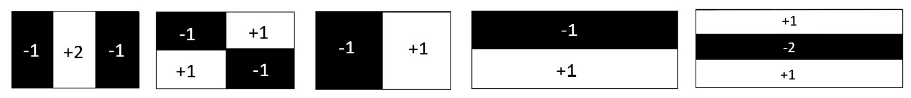
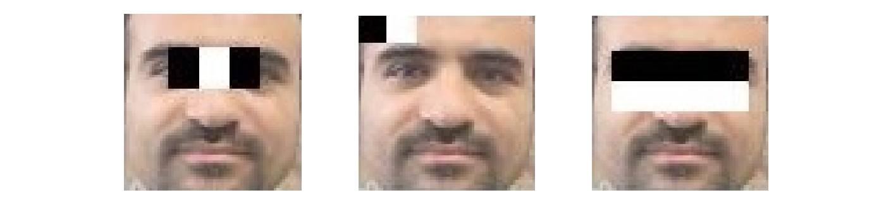
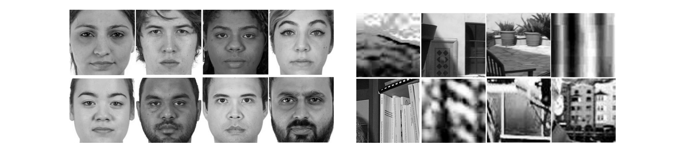

# Project Title: Fully Dispersed Haar-like Filters for Face Detection

## Description
This repository contains the MATLAB code and datasets for implementing the **Fully Dispersed Haar-like Filter** for feature extraction of face images. The goal of this project is to provide a Fully Dispersed Haar-like Filter for feature extraction, as proposed by **Z. Sedaghtjoo, H. Hosseinzadeh, and A. Shirzadi**. 

Haar-like filters are renowned for their simplicity, speed, and accuracy in various computer vision tasks. Haar-like features are local texture descriptors that quantify differences in the average intensity values between adjacent rectangular regions. The following figure illustrates several simple Haar-like filters that are commonly employed in feature extraction applications: 



As illustrated in the figure, Haar-like filters are commonly represented as combinations of two or more rectangular regions composed of black and white pixels.  
This figure showcases various examples of Haar-like filters, with the default weights clearly indicated on their respective rectangles. These filters can be applied for facial feature extraction, as shown in the next figure:



The feature value \( g(x) \) for a Haar-like filter is defined as follows:

\[
g(x) = v_1 \cdot m_1(x) + v_2 \cdot m_2(x),
\]

where \( x \) is an image, and \( m_1 \) and \( m_2 \) denote the mean intensities of the pixels within the black and white regions of the filter, respectively. The weights \( v_1 \) and \( v_2 \) correspond to these regions and are typically represented as two integers whose sum equals zero.

We introduce **Fully Dispersed Haar-like Filters**, which allow pixels to dynamically reposition themselves to optimize local feature detection. These filters offer enhanced accuracy for face detection and recognition tasks, including facial expression recognition across seven classes. The optimized filters achieve high accuracy, exceeding 98% for face detection and up to 94% for facial expression recognition. 

---

## Contents
- **MATLAB Code**: The main algorithm for feature extraction of face images. 
- **Datasets**: 
  - [Google Drive Link to Datasets](https://drive.google.com/drive/folders/1XOVwqI72RaLmJrDujGvBX3SMNUjKxVut?usp=drive_link)

Some face and clutter images applied in this research are shown in the figure below:



The two-dimensional face and clutter images are resized to \( 64 \times 64 \) and converted into one-dimensional vectors by arranging the pixels in the images. For instance, a \( 64 \times 64 \) image is transformed into a row vector of length 4096 and added to the dataset.

---

## Face Databases and Clutter Matrices

This repository contains four face image datasets represented as matrices, along with clutter matrices used for processing and analysis. Below are detailed descriptions of the datasets and their corresponding clutter matrices:

### 1. **Face_CFD**
- **Matrix Size:** `1410 x 4096`  
  Each row represents a face image, where the original image size is `64 x 64` pixels.  
- **Clutter Matrix:**  
  **Clutter1** (`2000 x 4096`) was used for this dataset.

---

### 2. **Face_AR**
- **Matrix Size:** `2600 x 4096`  
  Each row represents a face image of size `64 x 64` pixels.  
- **Clutter Matrix:**  
  **Clutter1** (`2000 x 4096`) was also used for this dataset.

---

### 3. **Face_MIT_CMU**
- **Matrix Size:** `2770 x 400`  
  Each row corresponds to a face image of size `20 x 20` pixels.  
- **Clutter Matrix:**  
  **Clutter20** (`200 x 400`) was utilized for this dataset due to the smaller image dimensions.

---

### 4. **Face_UTK**
- **Matrix Size:** `9456 x 4096`  
  Each row represents a face image of size `64 x 64` pixels.  
- **Clutter Matrix:**  
  **Clutter1 (Extended)** (`10675 x 4096`) was used for this dataset.

---

### Clutter Matrices
- **Clutter1** (`2000 x 4096`): Used for Face_CFD and Face_AR datasets.  
- **Clutter20** (`200 x 400`): Used for the Face_MIT_CMU dataset.  
- **Clutter1 (Extended)** (`10675 x 4096`): Used for the Face_UTK dataset.

---

## Installation
1. Clone this repository:
   ```bash
   git clone https://github.com/Sedaghatjoo/fully-dispersed-Haar-like-filter-FD.git
   ```

2. Ensure you have MATLAB **R2020b** or newer installed.

---
### Usage
1. Open the MATLAB script **Fully_Dispersed_HaarLike.m**.
2. Download the dataset from [Google Drive](https://drive.google.com/drive/folders/1XOVwqI72RaLmJrDujGvBX3SMNUjKxVut?usp=drive_link).  
3. Load the dataset files in MATLAB:
   ```matlab
   load('Face.mat');
   load('Clutter.mat');
   ```
   **Note**: Replace `'Face.mat'` and `'Clutter.mat'` with the actual names of the dataset files downloaded from the Google Drive link. For example, if the file is named `Face_AR.mat`, replace `'Face.mat'` with `'Face_AR.mat'`.

4. Run the script to start the feature extraction process.  
5. Optional: Adjust the following parameters before running the code:
   - **`div`**: Training-to-testing ratio (default: `0.7`)  
   - **`num1`**: Number of black pixels in the filter (default: `256`)  
   - **`num2`**: Number of white pixels in the filter (default: `256`)  
   - **`Wh`**: Weights of the black and white parts (default: `[-1, 1]`)  
   - **`itter`**: Number of iterations for training (default: `200`)
   - - **`s_pic`**: Size of each image in data (default: `64`)
  
---

